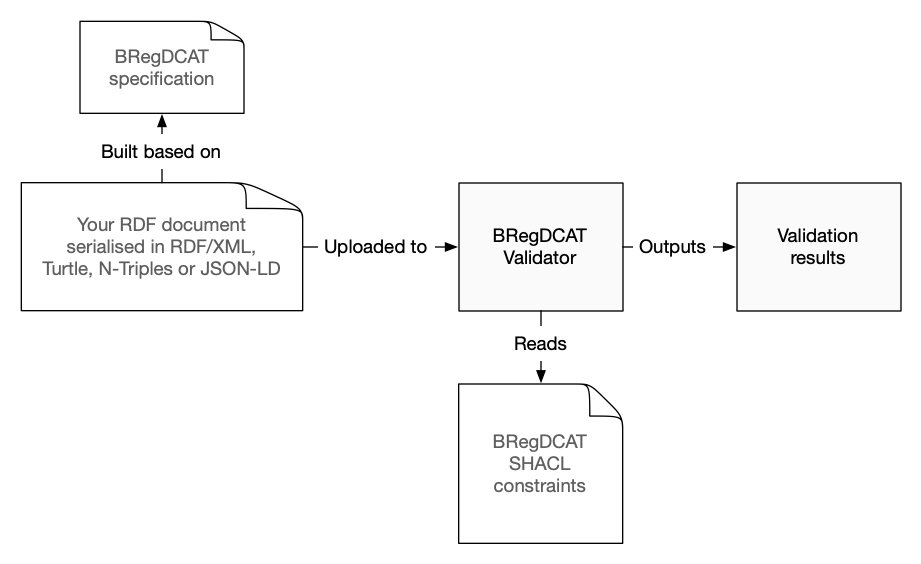
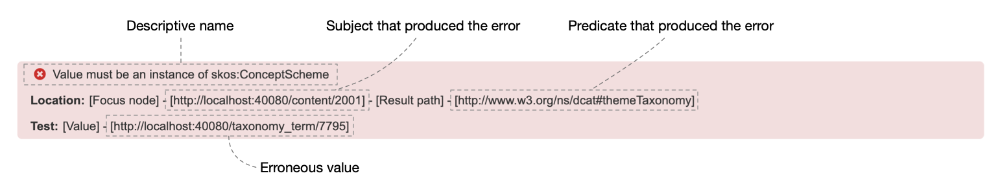

# Fixing BRegDCAT validation errors

## Introduction

This is a brief tutorial focused on how to fix validation errors reported by the [BRegDCAT Validator Web UI](https://www.itb.ec.europa.eu/shacl/bregdcat-ap/upload) in BRegDCAT RDF documents.

We will be using a RDF document serialized in RDF/XML (`original_with_errors.xml`) that represents a register of schools of secondary education in the region of Chalkidiki (Greece).

The reader should have a basic grasp of the concepts of linked data. The following list is an attempt at defining the technologies mentioned in this article in an easily understandable fashion. There are, however, lots of great resources in the Internet to learn about RDF. I personally find [A brief introduction to linked data](https://ontola.io/what-is-linked-data/) (by Joep Meindertsma) to be a really good entry point to the world of linked data.

- **RDF**: RDF is a data model to represent knowledge that may seem intuitive to us humans in a fashion that is understandable to machines (e.g. a _Person_ has a _name_). RDF is usually represented as a set of _subject - predicate - object_ triples that form a graph. It should be noted that RDF is an **abstract concept** that may be **serialized** (i.e. written to a file) in many different _RDF serialization formats_.
- **RDF/XML**: One of the existing _RDF serialization formats_, that is, a specification that defines how to write RDF data to a file using XML.
- **Turtle**: Another _RDF serialization format_ that is usually less verbose than XML and easier to read for humans.
- **SHACL**: RDF enables us, for instance, to define that a _Person_ has a _name_, but does not provide means to _constrain_ RDF graphs (e.g. a _Person_ must have exactly one _name_). SHACL is an specification that was created to fill this gap. SHACL files are also written using a _RDF serialization format_. For example, [these two RDF files in Turtle format](https://github.com/ISAITB/validator-resources-bregdcat-ap/tree/master/resources/v2.00) are the SHACL constraints used by the BRegDCAT validator.

So what happens when a RDF dataset is uploaded to the BRegDCAT validator? The following diagram shows a simplified view of this process.



## Anatomy of a validation error

The following image shows the distinct parts of a validation error item as shown by the BRegDCAT Validator UI:



Please note that there are instances where the _descriptive name_ is a bit obscure and does not provide any valuable information:

```
Value does not have shape _:3738359295e3d3041c81688d133ede8b
```

In this case we have to actually look at the SHACL constraints to identify what the error is about. We will see an example in the next section.

## Examples

> It should be noted that we focus entirely on fixing the validation issues reported by the validator tool. However, it could be argued that the resulting dataset is not strictly valid. For example, node `<http://localhost:40080/taxonomy_term/7795>` ends up being an instance of both `<skos:Concept>` and `<skos:ConceptScheme>` at the same time. Further updates could be required, but are outside of the scope of this post.

This section presents the errors reported by the BRegDCAT Validator for the file `original_with_errors.xml` and explicitly shows the process to fix them. Hopefully, this will enable the readers to extrapolate to similar errors in other RDF files.

File `fixed_errors.xml` contains the changes (i.e. the validator does not report any errors for this file).

### Invalid number of property values

```
Property needs to have at least 1 values, but found 0
Location:[Focus node] - [http://localhost:40080/content/6001] - [Result path] - [http://purl.org/dc/terms/identifier]
```

This error is due to the fact that the node (i.e. _subject_) `<http://localhost:40080/content/6001>` lacks the property (i.e. _predicate_) `<http://purl.org/dc/terms/identifier>`.

If we look at the node in the file, we can see that is indeed the case. Please note that in [RDF/XML](https://www.w3.org/TR/rdf-syntax-grammar/#section-Syntax-node-property-elements) node properties are defined as children of `<rdf:Description>` where `rdf:about` is equal to the IRI of the node. Thus, we simply need to add `<ns2:identifier>` with a literal value that serves as unique identifier of the dataset.

```
<rdf:Description rdf:about="http://localhost:40080/content/6001">
    <rdf:type rdf:resource="http://www.w3.org/ns/dcat#Dataset" />
    ...
    <ns2:identifier>dataset-of-schools-of-secondary-education-of-the-regional-unit-of-chalkidiki</ns2:identifier>
</rdf:Description>
```

There are two more errors that can be fixed in the same fashion:

```
Property needs to have at least 1 values, but found 0
Location:[Focus node] - [http://localhost:40080/content/2001] - [Result path] - [http://purl.org/dc/terms/identifier]
```

```
Property needs to have at least 1 values, but found 0
Location:[Focus node] - [http://localhost:40080/content/600001] - [Result path] - [http://purl.org/dc/terms/identifier]
```

Unlike the previous errors, the following two violations require us to delete existing triples instead of adding them. In this particular case we need to keep only one item for property `<http://purl.org/dc/terms/modified>` for both nodes `<http://localhost:40080/content/2001>` and `<http://localhost:40080/content/6001>`.

```
Property may only have 1 value, but found 8
Location:[Focus node] - [http://localhost:40080/content/2001] - [Result path] - [http://purl.org/dc/terms/modified]
```

```
Property may only have 1 value, but found 4
Location:[Focus node] - [http://localhost:40080/content/6001] - [Result path] - [http://purl.org/dc/terms/modified]
```

### Value must be an instance of _Class_

The following two violations refer to the same issue, that is, the fact that node `<http://localhost:40080/taxonomy_term/7795>` is not a `<skos:Concept>`:

```
Value must be an instance of skos:Concept
Location:[Focus node] - [http://localhost:40080/content/600001] - [Result path] - [http://www.w3.org/ns/dcat#theme]
Test:[Value] - [http://localhost:40080/taxonomy_term/7795]
```

```
Value must be an instance of skos:Concept
Location:[Focus node] - [http://localhost:40080/content/6001] - [Result path] - [http://www.w3.org/ns/dcat#theme]
Test:[Value] - [http://localhost:40080/taxonomy_term/7795]
```

Both `<http://localhost:40080/content/600001>` and `<http://localhost:40080/content/6001>` contain the following statement:

```
<ns5:theme rdf:resource="http://localhost:40080/taxonomy_term/7795" />
```

What this means is that the value of property `<ns5:theme>` is a node (`<http://localhost:40080/taxonomy_term/7795>`) instead of a literal.

To fix this issue we need to explicitly state that node `<http://localhost:40080/taxonomy_term/7795>` is a `<skos:Concept>` by adding the following content to the root node (`<rdf:RDF>`).

> Please note that an instance of `<skos:Concept>` requires both properties `<ns2:title>` and `<skos:prefLabel>`. You can check this by removing these properties and uploading the resulting file to the validator.

```
<skos:Concept rdf:about="http://localhost:40080/taxonomy_term/7795">
    <ns2:title>Theme title</ns2:title>
    <skos:prefLabel>Theme preferred label</skos:prefLabel>
</skos:Concept>
```

The process to fix the next error violation is very similar:

- Add an entry to the root node (`<rdf:RDF>`) stating that `<http://localhost:40080/taxonomy_term/7795>` is a `<skos:ConceptScheme>`.
- Upload the file to the validator to see if an instance of `<skos:ConceptScheme>` has obligatory fields.
- The validator reports no further errors related to `ConceptScheme`.

```
Value must be an instance of skos:ConceptScheme
Location:[Focus node] - [http://localhost:40080/content/2001] - [Result path] - [http://www.w3.org/ns/dcat#themeTaxonomy]
Test:[Value] - [http://localhost:40080/taxonomy_term/7795]
```

```
<skos:ConceptScheme rdf:about="http://localhost:40080/taxonomy_term/7795" />
```

### Value does not have _Shape_

```
Value does not have shape :DateOrDateTimeDataType_Shape
Location:[Focus node] - [http://localhost:40080/content/2001] - [Result path] - [http://purl.org/dc/terms/issued]
```

These type of violations tell us that a node does not conform to a _shape_. A SHACL _shape_ defines which properties must appear and in which quantity.

In this particular case the validator reports that the value of property `<http://purl.org/dc/terms/issued>` must conform to `DateOrDateTimeDataType_Shape`. However, it is currently a literal:

```
<ns2:issued rdf:datatype="http://www.w3.org/2000/01/rdf-schema#Literal"></ns2:issued>
```

To check the shape definition we must search in the [BRegDCAT SHACL shapes file](https://github.com/ISAITB/validator-resources-bregdcat-ap/blob/master/resources/v2.00/BRegDCAT-AP_shacl_shapes_2.00.ttl) for the shape ID (`DateOrDateTimeDataType_Shape`):

```
:DateOrDateTimeDataType_Shape
    a sh:NodeShape ;
    rdfs:comment "Date time date disjunction shape checks that a datatype property receives a date or a dateTime literal" ;
    rdfs:label "Date time date disjunction" ;
    sh:message "The values must be data typed as either xsd:date or xsd:dateTime" ;
    sh:or ([
            sh:datatype xsd:date
        ]
        [
            sh:datatype xsd:dateTime
        ]
    ) .
```

In this case we need to replace the entry for `<ns2:issued>` for something similar to:

```
<ns2:issued rdf:datatype="http://www.w3.org/2001/XMLSchema#dateTime">2021-02-25T08:52:52+01:00</ns2:issued>
```
